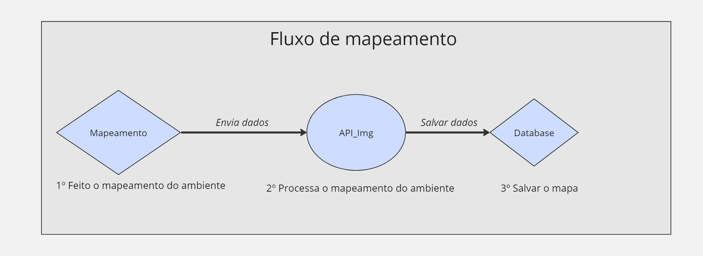
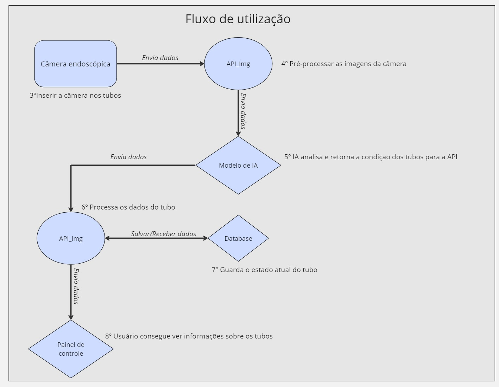
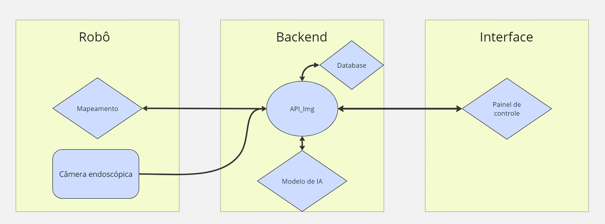

## Introdução 

&emsp;A arquitetura de um sistema é uma parte primordial para compreender como as diferentes partes se conectam e como a integração dessas partes foi pensada.

&emsp;Nesta primeira interação, foi concebida uma arquitetura simples. O objetivo inicial é permitir que o robô mapeie o reboiler para se localizar e identificar os tubos individuais. Posteriormente, o robô se desloca para cada tubo, inserindo uma câmera de endoscopia dentro do cano para realizar a análise dos dados. Isso permite que o modelo de inteligência artificial determine se o tubo está limpo ou não.

## Fluxo de dados na arquitetura

&emsp;Para facilitar a compreensão da arquitetura, foi desenvolvido um fluxo de dados correspondente. Isso permite entender os dois principais processos abordados na primeira iteração da solução.

&emsp;Antes de mais nada, dado que o grupo ainda não teve nenhum contato prévio com o robô, alguns detalhes mais minuciosos não foram decididos. No entanto, a ideia inicial é realizar o mapeamento e, em seguida, permitir que o usuário da solução movimente o robô e analise cada tubo conforme sua vontade.

&emsp;O processo está dividido em duas etapas. A primeira é o mapeamento e a segunda é a identificação de tubos que contenham impurezas. Ambas serão detalhadas a seguir, sendo o mapeamento fidedigno do ambiente o primeiro passo para o correto funcionamento da solução.

### Mapeamento do ambiente 

&emsp;O primeiro fluxo é o de **mapeamento do ambiente**, responsável por mapear o reboiler e permitir com que o robô consiga se localizar e gerar um mapa do local. 

&emsp;Na figura abaixo, é possível entender melhor como o mapeamento vai funcionar. 

<b> Figura Fluxo de Mapeamento </b>

  
  
<b>Fonte:</b> Elaborado por Cannabot

- 1º  **Mapeamento do ambiente :** Utilizando técnicas como o SLAM, será realizado o mapeamento do reboiler e a identificação da localização de cada tubo.

- 2º **Processamento do mapa :** O mapa precisa ser processado para que possa ser armazenado no banco de dados.

- 3º **Salvar o mapa :** O mapa que foi processado é salvo no banco de dados. 

### Fluxo de utilização

&emsp;Após a conclusão bem-sucedida do mapeamento, segue-se a utilização da solução. Aqui, quem assume o controle é o operador do robô, que tem a habilidade de escolher para onde o robô deve ir e qual tubo ele gostaria de verificar. 

&emsp;Na figura abaixo, é possível entender melhor como o mapeamento vai funcionar. 

<b> Figura Fluxo de Utilização </b>

  
  
<b>Fonte:</b> Elaborado por Cannabot

&emsp;Após o mapeamento com sucesso o usuário é capaz de decidir como prosseguir com o fluxo de utilização do robô. Considerando que o mesmo queira realizar a checagem de um tubo o processo é o seguinte. 

- 3º  **Inserir câmera :** A partir de um input do usuário, a câmera é enfiada dentro do tubo. 

- 4º **Processar imagens da câmera :** As imagens da câmera são enviadas para a API e ocorre o pré-processamento. Esta etapa envolve tratamentos na imagem que aumentem o contraste entre o tubo e a sujeira, facilitando a detecção de impurezas pelo modelo

- 5º **Análise de imagens :** O modelo de IA processa as imagens e retorna se há impurezas ou não no tubo. 

- 6º **Processamento dos dados do tubo :** Após a resposta sobre a limpeza do tubo, é necessário determinar sua localização e consolidar todas essas informações para uso futuro.

- 7º **Guardar o estado do tubo :** Nesta etapa, os dados gerados no passo anterior são salvos em um banco de dados e podem ser consumidos pela API imediatamente.

- 8º **Visualização de dados :** Após as informações do tubo serem salvas. É possível consultar as mesmas em uma uma página web interativa que contém todas as informações sobre os tubos que foram analisados.  

&emsp;Por fim, é esperado que com o entendimento do fluxo de informações a arquitetura que será descrita posteriormente faça mais sentido. 

## Arquitetura 

&emsp;Pensando em uma arquitetura modularizada capaz de atender às demandas especificadas anteriormente, foi desenvolvido o esquemático abaixo para representar essa primeira iteração. 

<b> Figura Arquitetura </b>

  
  
<b>Fonte:</b> Elaborado por Cannabot

***Legenda*:** Um aspecto importante ao observar a arquitetura é que cada quadrado representa um bloco individual do sistema. Além disso, as figuras em formato de losango representam partes do software, enquanto os retângulos representam peças de hardware e o circulo é a API que é o coração de todo o sistema no momento. 

&emsp;Nos parágrafos a seguir, serão destacados a função de cada um desses módulos e a integração dos mesmos.

#### Mapeamento 

&emsp;O módulo de mapeamento é responsável por mapear o reboiler e identificar cada buraco individual. O objetivo é haver um controle e um método que permita com que o robô saiba onde está no espaço e garantir que todos os 2000 tubos sejam verificados. 
O mapeamento possívelmente será realizado por SLAM que é uma tecnologia que utiliza raios infravermelhos para permitir com que o robô mapeie o ambiente e saiba onde está no momento. 

#### Câmera endoscópica 

&emsp;A câmera é a responsável por gravar as imagens dentro do tubo e enviar as imagens para a *API_Img*. O modelo de câmera exato ainda não foi definido, mas provavelmente será algo similar ao seguinte [produto](https://www.amazon.com.br/Endosc%C3%B3pio-Digital-Flex%C3%ADvel-Celular-Notebook/dp/B09GW42846/ref=asc_df_B09GW42846/?hvadid=379773237758&hvpos=&hvnetw=g&hvrand=14252254663550192321&hvpone=&hvptwo=&hvqmt=&hvdev=c&hvdvcmdl=&hvlocint=&hvlocphy=1001773&hvtargid=pla-1462742082936&psc=1&mcid=bd71615640a332fc9558e57f1a758d5d).

#### API_Img 

&emsp;A api de imagem é o coração da solução. Atualmente, ela tem o objetivo de conectar partes distintas nos seguintes casos :

- Receber o mapa e salvar no banco de dados.
- Receber as imagens da câmera e pré-processá-las. 
- Enviar as imagens para a IA.
- Receber e processar as respostas da IA junto com dados do tubo que foi analisado.
- Salvar os dados da etapa anterior no backend.
- Enviar os dados dos tubos para a interface (frontend).

&emsp;Como o projeto ainda não teve nenhum desenvolvimento de código, visto que a primeira Sprint no modelo Inteli é baseada no entendimento do negócio, o grupo ainda não decidiu as tecnologias que serão utilizadas para a API. No entanto, é provável que seja utilizado o FastAPI, que é um framework de Python que funciona de forma assíncrona. A maioria dos membros da equipe já possui experiência com esse framework, além da vasta documentação disponível online.

&emsp;No futuro, há grandes chances de o grupo optar por dividir essa API em partes menores, visando aumentar a modularidade do código. Nas próximas sprints, versões mais aprimoradas serão desenvolvidas.

#### Banco de dados 

&emsp;O banco de dados para esse projeto tem duas missões especifícas: 
- Salvar o mapa 
- Salvar informações sobre o tubo 

&emsp;Assim, um banco de dados relacional é uma escolha mais adequada para esse tipo de projeto, visto que permite a criação de relações entre tabelas, o que é fundamental para garantir a rastreabilidade de cada tubo dentro do reboiler.

&emsp;Duas opções a serem consideradas neste caso são o PostgreSQL ou o SQLite3. Nas próximas sprints, onde haverá o desenvolvimento de código, ocorrerá o detalhamento da tecnologia escolhida e os motivos por trás dela.

#### Modelo de IA 

&emsp;O modelo de IA tem como seu principal objetivo verificar se um tubo esta limpo ou não. Com base nessa informação os dados são enviados para o frontend. 

&emsp;A tecnologia do modelo de visão computacional ainda não foi escolhida, mas como não há um dataset disponibilizado pela empresa, é provável que seja utilizado algum modelo pré-treinado.

&emsp;Ao realizar uma pesquisa na literatura científica sobre o tema, é possível encontrar artigos sobre a utilização de IA para identificação de obstruções em tubulações.

[Exemplo - 1](https://onlinelibrary.wiley.com/doi/10.1002/cjce.24202)

[Exemplo - 2](https://www.mdpi.com/2079-9292/12/17/3606)

&emsp;Os estudos apontam resultados extremamente satisfatórios e indicam uma grande vantagem em utilizar modelos pré-treinados. Especialmente no segundo exemplo, que utiliza redes neurais profundas para detectar obstruções em tubulações de água em ambientes urbanos.

#### Painel de Controle 

&emsp;O painel de controle é responsável por permitir uma visualização geral dos tubos do reboiler e caso exista tubos sujos há um aviso indicando o estado atual de cada tubo. 

&emsp;Dada a experiência prévia dos membros do grupo em desenvolvimento web, o framework escolhido provavelmente será o React, visto que sua documentação é ampla e a conexão com um backend em FastAPI é bastante simples.

## Conclusão 

&emsp;Nesta primeira sprint, o principal objetivo foi compreender o projeto e conceber um método para atender às demandas da Atvos. As próximas versões da arquitetura conterão mais atualizações e mudanças, as quais serão implementadas à medida que os membros do grupo consolidarem seus aprendizados.

&emsp;Por último, mas não menos importante, é preciso levar em consideração que as escolhas de tecnologias nesta etapa estão sujeitas a muitas alterações, visto que a primeira sprint de desenvolvimento foi dedicada a entender melhor como o problema funciona e quais são as necessidades da Atvos com o robô.