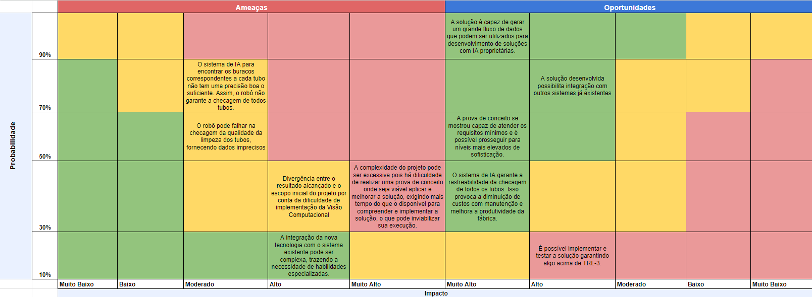

## Introdução

&emsp;A matriz de riscos é uma ferramenta essencial na análise de negócios, organizada em forma de tabela onde os riscos são listados nas linhas, e os impactos e probabilidades são definidos nas colunas. Então, ao preencher as células da matriz com informações sobre a gravidade do risco (impacto) e a probabilidade de ocorrência, a organização consegue identificar os riscos mais críticos e aqueles que requerem maior atenção e alocação de recursos para serem gerenciados.
Essa ferramenta é fundamental na avaliação e gestão de riscos em projetos ou implementações, pois uma matriz bem elaborada permite à equipe priorizar os riscos mais críticos, facilitando a implementação de medidas preventivas e corretivas adequadas para reduzir os possíveis impactos negativos. Com base nas particularidades da equipe e do projeto em questão, a seguir apresenta-se uma análise de riscos específica para esta solução:

 

Fonte: Elaborado pelo grupo Cannabot

## Descrição dos riscos

Também, disponibiliza-se a transcrição dos textos inseridos na matriz:

Ameaças:
- O sistema de IA para encontrar os buracos correspondentes a cada tubo não tem uma precisão boa o suficiente. Assim, o robô não garante a checagem de todos tubos. ( Probabilidade: Alta 70% x Impacto: Moderado)
- O robô pode falhar na checagem da qualidade da limpeza dos tubos, fornecendo dados imprecisos ( Probabilidade: Média 50% x Impacto: Médio)
- Divergência entre o resultado alcançado e o escopo inicial do projeto por conta da dificuldade de implementação da Visão Computacional. ( Probabilidade: Baixa 30% x Impacto: Alto)
- A complexidade do projeto pode ser excessiva pois há dificuldade de realizar uma prova de conceito onde seja viável aplicar e melhorar a solução, exigindo mais tempo do que o disponível para compreender e implementar a solução, o que pode inviabilizar sua execução. ( Probabilidade: Baixa 30% x Impacto: Muito Alto)
- A integração da nova tecnologia com o sistema existente pode ser complexa, trazendo a necessidade de habilidades especializadas.( Probabilidade: Muito Baixa 10% x Impacto: Alto)

Riscos Reais:
- A solução é capaz de gerar um grande fluxo de dados que podem ser utilizados para desenvolvimento de soluções com IA proprietárias. ( Probabilidade: Muito Alta 90% x Impacto: Muito Alto)
- A solução desenvolvida possibilita integração com outros sistemas já existentes ( Probabilidade: Alta 70% x Impacto: Alto)
- A prova de conceito se mostrou capaz de atender os requisitos mínimos e é possível prosseguir para níveis mais elevados de sofisticação. (Probabilidade: Alta 50% x Impacto: Muito Alto) 
- O sistema de IA garante a rastreabilidade da checagem de todos os tubos. Isso provoca a diminuição de custos com manutenção e melhora a produtividade da fábrica. ( Probabilidade: Baixa 10% x Impacto: Muito Alto)
- É possível implementar e testar a solução garantindo algo acima de TRL-3. ( Probabilidade: Baixa 10% x Impacto: Alto)

## Plano de ação em relação aos riscos 

&emsp;Nesta secção será detalhado como é possível lidar com os riscos e respostas ao mesmo.

##### O sistema de IA para encontrar os buracos correspondentes a cada tubo não tem uma precisão boa o suficiente. Assim, o robô não garante a checagem de todos tubos.

*Plano de Ação:*  Melhorar a resolução da imagem que está sendo utilizada de input no modelo. Isso envolve trocar o sistema de câmeras inicial por um mais atual e tecnológico.
*Resposta ao Risco:* Tentar utilizar imagens de resolução e iluminação melhores. Além disso, é possível testar estratégias de tratamentos de imagens que melhoram o contraste.

##### O robô pode falhar na checagem da qualidade da limpeza dos tubos, fornecendo dados imprecisos

*Plano de Ação:* Para mitigar esse risco em implementações futuras é possível acoplar uma câmera que tenha uma resolução maior.
*Resposta ao Risco:* Fazer uma checagem antes e depois do processo de limpeza. Caso o modelo não tenha uma boa resposta é necessário fazer a checagem de novo.

##### Divergência entre o resultado alcançado e o escopo inicial do projeto por conta da dificuldade de implementação da Visão Computacional.

*Plano de Ação:* Para mitigar essa ameaça, é essencial estabelecer uma comunicação clara com o parceiro desde o início do projeto. Isso envolve definir e documentar o escopo do projeto e realizar revisões periódicas para garantir que o projeto esteja conforme o planejado, evitando conflitos e garantindo a satisfação do parceiro. Também, estudar formas de aplicar Visão Computacional de uma forma coerente com as dores do parceiro.
*Resposta ao Risco:* Registrar todas as alterações no escopo, obter a aprovação do cliente e só então implementá-las.

##### A complexidade do projeto pode ser excessiva pois há dificuldade de realizar uma prova de conceito onde seja viável aplicar e melhorar a solução, exigindo mais tempo do que o disponível para compreender e implementar a solução, o que pode inviabilizar sua execução.

*Plano de Ação:* Ao utilizar o método Scrum, a equipe deve dividir o projeto em fases ou etapas menores e mais gerenciáveis, chamadas de sprints, o que facilita o desenvolvimento da solução de forma eficiente, gerenciando melhor as dificuldades que serão enfrentadas durante as 10 semanas de projeto. 
*Resposta ao Risco:* O Scrum Master deve acompanhar de perto o progresso do projeto e estar pronto para realocar recursos ou reavaliar prazos conforme necessário, a fim de lidar com a complexidade. Também, para garantir a qualidade e a viabilidade técnica do projeto, é essencial implementar processos de revisão de design e código.

##### A integração da nova tecnologia com o sistema existente pode ser complexa, trazendo a necessidade de habilidades especializadas.

*Plano de Ação:* Realizar uma análise profunda dos requisitos de integração e identificar as habilidades necessárias para sua execução.
*Resposta ao Risco:* Uma resposta é garantir uma comunicação clara com a equipe responsável pela integração, sendo fundamental para assegurar que todos os requisitos e expectativas sejam plenamente compreendidos.