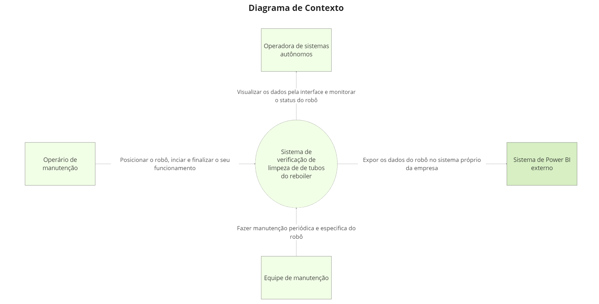
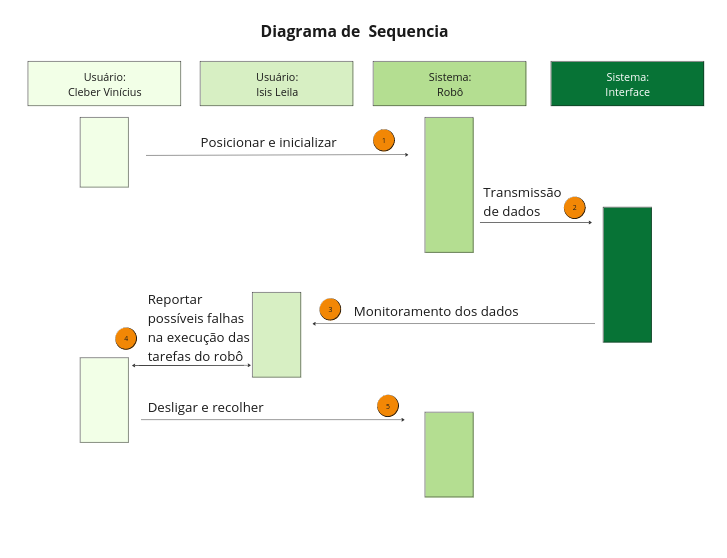

# Arquitetura da informação

### Diagrama de Contexto 

&emsp;Um diagrama de contexto é um diagrama que foca mais em uma visão de mais alto nível do sitema, mostrando como o sistema interage com componentes externos e como eles interragem entre si. A seguir temos o diagrama de contexto do projeto:

<b>Figura 1:</b> Diagrama de contexto 

    
  
<b>Fonte:</b> Elaborado por Cannabot

&emsp;Nosso sistema é composto pelo robô teleoperado chamado Turtlebot, o backend que recebe os dados do robô e trata eles e o frontend exibe os dados para o usuário. Em relação aos elementos externos, temos a operadora de sistemas autônomos, que, de acordo com a persona desenvolvida, é a ísis Leila, responsável por monitorar o robô e o sistema. Também, temos o operário de manunteção, que é representado pela persona Cleber Vinicius, que é responsável por posicionar o robô, iniciar e finalizar seu funcionamento e realizar manutenções básicas. Além disso, temos a equipe de manunteção, que é como fosse um time ou empresa que presta serviços de manutenção para a Atvos que possui o sistema, responsável por fazer manutenções mais complexas, periódica e espeficas no robô. Por último, temos o Sistema de Power BI externo, que é um sistema de visualização de dados que a Atvos já utiliza, e que será alimentado com os dados do nosso sistema atraves de uma API que será desenvolvida.

### Diagrama de Sequência

&emsp;Um diagrama de sequência (UX) desempenha um papel crucial na concepção e no desenvolvimento de projetos, fornecendo uma representação visual das interações entre os usuários e o sistema. Ao oferecer uma visão detalhada das etapas que os usuários percorrem durante suas interações, desde a inicialização do sistema até a conclusão de tarefas específicas, o diagrama de sequência UX permite aos designers compreenderem melhor as necessidades e expectativas dos usuários. Essa compreensão profunda é essencial para criar uma experiência do usuário fluida e intuitiva, além de identificar oportunidades de otimização e aprimoramento da interface. Assim, o diagrama de sequência UX serve como um guia valioso durante todo o processo de design, desde a concepção inicial até a implementação final, garantindo que o produto final atenda às necessidades e expectativas dos usuários de forma eficaz.

<b> Figura 2:</b> Diagrama de sequência 

  
  
<b>Fonte:</b> Elaborado por Cannabot

&emsp;Ao observar nosso diagrama é possível visualizar marcações com números em suas interações, iremos detalhar melhor essas interações abaixo de forma textual:

&emsp;1- O operário de manutenção sobe com o robô no reboiler e posiciona ele no centro para que seja inicializado.

&emsp;2- O robô inicia a operação e transmissão de dados para a interface da solução.

&emsp;3- O operador de sistemas começa a monitorar os dados que estão chegando na interface.

&emsp;4- Tanto o operário de manutenção quanto o operador de sistemas observa possíveis ajustes necessários a serem feitos no robô e apontam no relatório final da operação, como reparosna carenagem e problemas no software.

&emsp;5- O operário de manutenção desliga e recolhe o robô para que seja levado até o armázem.

&emsp;Em suma, o diagrama de sequência UX é uma ferramenta indispensável para o desenvolvimento de projetos orientados ao usuário. Ao oferecer uma representação visual clara das interações entre os usuários e o sistema, ele permite aos designers compreenderem profundamente as necessidades e expectativas dos usuários, orientando o processo de design para criar uma experiência do usuário excepcional. Desde a concepção até a implementação, o diagrama de sequência UX serve como um guia valioso, garantindo que o produto final seja intuitivo, eficaz e capaz de proporcionar uma experiência de usuário satisfatória.

&emsp;Para garantir a inovação em nosso projeto, listamos elementos que visam não apenas atender às necessidades atuais, mas também antecipar e adaptar-se às demandas futuras. Então assim, destacamos três aspectos inovadores em nossa arquitetura da informação, sendo eles: Integração de IA e Machine Learning com a intenção de implementar algoritmos de inteligência artificial e machine learning no backend para otimizar a análise dos dados recebidos do robô Turtlebot, permitindo a detecção automática de padrões, identificação de anomalias e sugestão de melhorias, aumentando a eficiência operacional e reduzindo a necessidade de intervenção humana. O segundo aspecto é uma Interface Adaptativa e Personalizada pois o frontend será projetado para oferecer uma experiência altamente adaptativa e personalizada para os usuários. Com base nas preferências e histórico de interações de cada usuário, a interface é capaz de ajustar dinamicamente o conteúdo e a apresentação, garantindo uma experiência única e relevante para cada um. Por fim, o terceiro aspecto é uma API Aberta e Ecossistema de Colaboração que permite a integração fácil e rápida de novos módulos e funcionalidades ao nosso sistema, onde, também, desenvolvedores externos podem contribuir com novas ideias e soluções, enriquecendo constantemente a plataforma e promovendo a inovação contínua.
Esses elementos de inovação não apenas diferenciam nosso projeto, mas também garantem que ele esteja preparado para enfrentar os desafios e aproveitar as oportunidades que o futuro reserva.