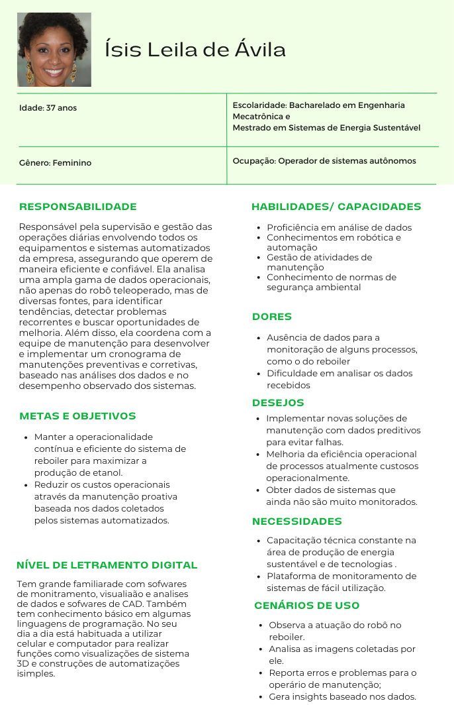

# Personas

&emsp;A persona, um retrato fictício do cliente ideal de um negócio, é elaborada com base em informações e características reais do público-alvo. Essa ferramenta constroi representações fictícias de clientes ideais, baseadas em dados reais e pesquisas com o público-alvo. Elas ajudam a entender melhor as necessidades, dores, objetivos e comportamentos dos usuários finais.

&emsp;Desenvolver personas pode ajudar uma equipe a formular um IoT para a empresa Ativos. Isso porque, ao criar personas, a equipe pode se colocar no lugar dos usuários e criar soluções mais adequadas e personalizadas para eles. Como parte deste projeto, foram desenvolvidas representações visuais ilustrativas de três personas principais identificadas abaixo:

<b> Figura persona 1 - Persona:</b> Ísis Leila 

  
  
<b>Fonte:</b> Elaborado por Cannabot

<b> Figura persona 1 - Persona:</b> Cleber Vínicius 

  
  
<b>Fonte:</b> Elaborado por Cannabot

&emsp;Em resumo, a criação de personas é mais do que uma simples representação gráfica de usuários; é um processo dinâmico e estratégico que amplia a compreensão das necessidades, expectativas e desafios que nossos clientes enfrentam. Ao desenvolver personas significativas, não apenas moldamos produtos e serviços mais alinhados com as demandas reais, mas também cultivamos uma conexão mais profunda e empática com nosso público.

&emsp;Portanto, a construção de personas transcende a esfera do design e se estende a toda a estratégia empresarial, orientando-nos na busca constante pela satisfação do cliente e pela inovação centrada nas pessoas. Dessa maneira, destaca-se o público raiz que vai utilizar a solução: profissionais fabris e equipes de gestão. Com isso em mente, a equipe CannaBot pode guiar o desenvolvimento com objetivos claros e palpáveis.

&emsp;Fontes da pesquisa feita por trás da elaboração das personas do grupo Cannabot:

&emsp;Para o gerador facial de pessoas que não existem:
  - THIS PERSON DOES NOT EXIST. [S.l.], [s.d.]. Disponível em: https://this-person-does-not-exist.com/pt. Acesso em: 27 abr. 2024.

&emsp;Para o artigo da União Europeia sobre letramento digital:
  - JOINT RESEARCH CENTRE. Novo relatório DigComp desenvolve níveis de proficiência. [S.l.], 12 maio 2017. Disponível em: https://joint-research-centre.ec.europa.eu/jrc-news-and-updates/new-digcomp-report-develops-proficiency-levels-2017-05-12_en. Acesso em: 27 abr. 2024.

&emsp;Para observar dados demográficos da persona no relatório anual da Atvos:
  - ATVOS. Relatório anual. [S.l.], [s.d.]. Disponível em: https://atvos.com/comunicacao/relatorio-anual/. Acesso em: 27 abr. 2024.

