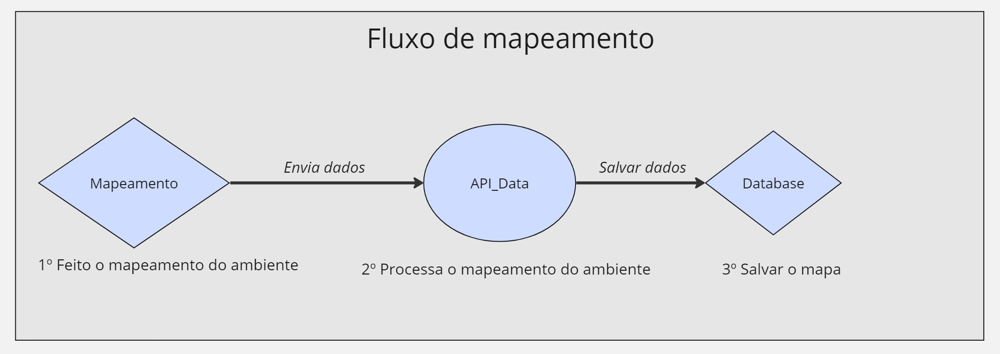
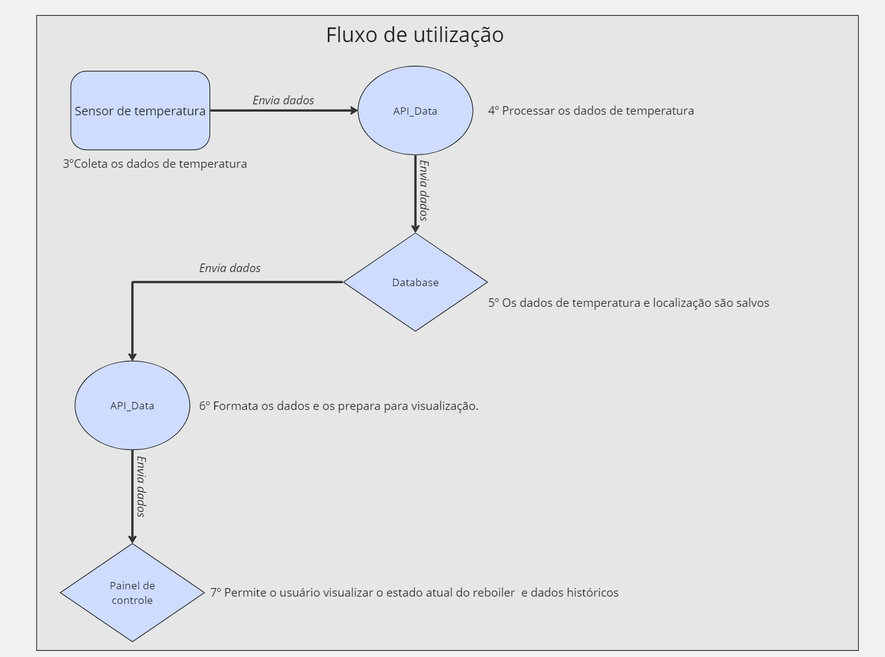
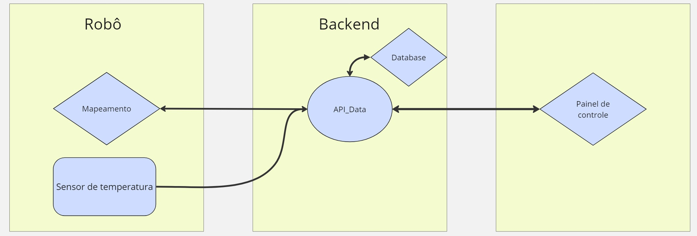

## Introdução 

&emsp;Antes de iniciar a explicação da arquitetura é recomendado ao leitor que leia a secção *Segunda sprint*. Neste texto existem explicações em mais detalhes sobre os motivos das alterações que foram realizadas no projeto. 

## Mudança de escopo 

&emsp;Após conversas com funcionários da Atvos, foi explicado que o processo de manutenção é realizado semanalmente e há necessidade de que seja algo bem rápido. 

&emsp;Assim, ao invés de ser um robô que realiza o mapeamento dos tubos e em seguida insere uma câmera endoscópica em cada tubo para verificar se ainda existem vestígios de sujeira, o grupo optou por um caminho mais simples e que gera valor em outras frentes para a empresa.

&emsp;O novo robô tem como objetivo ficar circulando por dentro do reboiler em funcionamento e medir informações internas como temperatura, concentração de açúcares e qualquer outro tipo de medição que auxilie a manutenção dos reboilers.

&emsp;Em suma, o objetivo do robô nesta sprint é ser guiado pelo operador dentro do reboiler em funcionamento, gerar um fluxo de dados dessa medição e permitir que exista uma interface para que o usuário consiga interagir com o robô e visualizar os dados.

## Vantagens do novo projeto 

&emsp;A mudança de escopo muda o objetivo que o robô tem. Ao invés de uma solução que garante a qualidade da limpeza.  Foi feito a mudança para um robô que gera dados e ajuda na tomada de decisões de manutenção. São dois os principais ganhos que essa nova arquitetura atinge. 

***Geração de dados*** Com o aumento exponencial da capacidade computacional dos computadores e um ambiente de negócios cada vez mais competitivo, um projeto que gera um fluxo de dados tem grande valor para a companhia. Primeiramente, é possível criar um dashboard que permite visualizar em tempo real os dados de dentro do reboiler e ajudar na tomada de decisão. Além disso, um fluxo de dados permite a criação de um futuro data warehouse e a implementação de modelos de IA proprietários que ajudam na tomada de decisão baseada em dados. 

***Aumento de produtividade*** Com um robô que é capaz de coletar informações intermitentes sobre o ambiente industrial em que está inserido, é possível criar um dashboard que permite visualizar em tempo real os dados de dentro do reboiler e ajudar na tomada de decisão se o reboiler já chegou a um ponto em que é necessário interromper a operação. Assim, o reboiler só é desligado no momento correto e garante o máximo de produtividade sem desligamentos desnecessários.

## Nova arquitetura 

## Fluxo de dados na arquitetura 2.0 

&emsp;Com base no que foi desenvolvido na sprint passada, nessa secção será apresentada o novo fluxo de dados e como que o mesmo irá funcionar. 

O processo continua dividido em duas etapas. A primeira é o mapeamento do reboiler e a segunda é a medição constante da temperatura dentro do reboiler. Ambas serão detalhadas a seguir, sendo o mapeamento fidedigno do ambiente o primeiro passo para o correto funcionamento da solução.

### Mapeamento do ambiente 

O primeiro fluxo é o de **mapeamento do ambiente**, responsável por mapear o reboiler e permitir com que o robô consiga se localizar e gerar um mapa do local. 

Na figura abaixo, é possível entender melhor como o mapeamento vai funcionar. 

<b> Figura Fluxo de Mapeamento </b>

  
  
<b>Fonte:</b> Elaborado por Cannabot

- 1º  **Mapeamento do ambiente :** Utilizando técnicas como o SLAM, será realizado o mapeamento do reboiler e o robô consegue se localizar.

- 2º **Processamento do mapa :** O mapa precisa ser processado para que possa ser armazenado no banco de dados.

- 3º **Salvar o mapa :** O mapa que foi processado é salvo no banco de dados. 

### Fluxo de utilização

Após a conclusão bem-sucedida do mapeamento, segue-se a utilização da solução. Aqui, quem assume o controle é o operador do robô, que tem a habilidade de escolher para onde o robô deve ir. Nas próximas sprints, o grupo deseja implementar métodos de controle autônomo para o robô, assim criando uma solução que não depende de humanos para controlar o robô.  

Na figura abaixo, é possível entender melhor como o mapeamento vai funcionar. 

<b> Figura Fluxo de Utilização </b>

  
  
<b>Fonte:</b> Elaborado por Cannabot

Após o mapeamento o robô precisa prosseguir com o fluxo de utilização do robô. Coletando os dados de temperatura e gerando um heatmap. 

- 3º  **Coleta de dados :** Conforme o robô se movimenta é feita a coleta de dados da temperatura. 

- 4º **Processar os dados de temperatura :** Os dados do sensor são enviados para a API e ocorre o processamento. Esta etapa envolve o ajuste de dados e a localização do mesmo para a criação de um heatmap.

- 5º **Salvar os dados :** Os dados que foram processados são salvos no banco de dados para uso futuro.

- 6º **Formatação e criação da imagem :** Os dados são coletados do banco de dados e novamente processados para permitir a criação de um heatmap.

- 7º **Visualização :** Nesta etapa, além de visualizar o heatmap com informações importantes é possível checar o histórico das medições e outras informações importantes. 

Por fim, é esperado que com o entendimento do fluxo de informações a arquitetura que será descrita posteriormente faça mais sentido. 

## Arquitetura 

Pensando em uma arquitetura modularizada capaz de atender às demandas especificadas anteriormente, foi desenvolvido o esquemático abaixo para representar essa primeira iteração. 

<b> Figura Arquitetura </b>

  
  
<b>Fonte:</b> Elaborado por Cannabot

***Legenda*:** Um aspecto importante ao observar a arquitetura é que cada quadrado representa um bloco individual do sistema. Além disso, as figuras em formato de losango representam partes do software, enquanto os retângulos representam peças de hardware e o circulo é a API que é o coração de todo o sistema no momento. 

Nos parágrafos a seguir, serão destacados a função de cada um desses módulos e a integração dos mesmos.

#### Mapeamento 

O módulo de mapeamento é responsável por mapear o reboiler. O objetivo é permitir que o operador controle o robô e, nas próximas semanas, implementar um sistema de movimentação autônoma. O mapeamento possivelmente será realizado por SLAM, que é uma tecnologia que utiliza raios infravermelhos para permitir que o robô mapeie o ambiente e saiba onde está no momento.

#### Sensor de temperatura  

O sensor de temperatura é a responsável por coletar as medições de dentro do reboiler e enviar para a *API_Data*. O modelo de sensor exato ainda não foi definido, mas precisa ser resistente e ter um grau elevado de precisão na medição de temperatura [produto](https://www.eletrogate.com/termopar-tipo-k-0-a-800c-modulo-de-leitura-max6675).

#### API_Data 

A api_Data é o coração da solução. Atualmente, ela tem o objetivo de conectar partes distintas nos seguintes casos :

- Receber o mapa e salvar no banco de dados.
- Receber os dados de temperatura e processá-las. 
- Salvar os dados da etapa anterior no backend.
- Montar o heatmap do reboiler e enviar os dados interface (frontend).

Como o projeto ainda não teve nenhum desenvolvimento de código no frontend/API, o grupo ainda não decidiu as tecnologias que serão utilizadas. No entanto, é provável que seja utilizado o FastAPI, que é um framework de Python que funciona de forma assíncrona.

No futuro, há grandes chances de o grupo optar por dividir essa API em partes menores, visando aumentar a modularidade do código. Nas próximas sprints, versões mais aprimoradas serão desenvolvidas.

#### Banco de dados 

O banco de dados para esse projeto tem duas missões especifícas: 
- Salvar o mapa.
- Salvar informações sobre a temperatura. 

Assim, um banco de dados relacional é uma escolha mais adequada para esse tipo de projeto, visto que permite a criação de relações entre tabelas, o que é fundamental para garantir a rastreabilidade de cada tubo dentro do reboiler.

Duas opções a serem consideradas neste caso são o PostgreSQL ou o SQLite3. Nas próximas sprints, onde haverá o desenvolvimento de código, ocorrerá o detalhamento da tecnologia escolhida e os motivos por trás dela.

#### Painel de Controle 

O painel de controle é responsável por permitir uma visualização geral dos tubos do reboiler e caso exista tubos sujos há um aviso indicando o estado atual de cada tubo. 

Dada a experiência prévia dos membros do grupo em desenvolvimento web, o framework escolhido provavelmente será o React, visto que sua documentação é ampla e a conexão com um backend em FastAPI é bastante simples.

## Conclusão 

Após as conversas na apresentação da primeira sprint, foi possível compreender melhor o projeto e conceber um método para atender às demandas da Atvos. Assim, as mudanças feitas na arquitetura refletem um melhor entendimento do problema e buscam implementar uma solução que tenha valor prático para a Atvos. Um robô que coleta temperatura e serve como início de um pipeline de dados é algo de grande valia para a empresa.

Nas próximas versões da arquitetura, haverá mais atualizações e mudanças, as quais serão implementadas à medida que os membros do grupo desenvolvem cada componente do sistema.

Por último, mas não menos importante, é preciso levar em consideração que as escolhas de tecnologias nesta etapa estão sujeitas a alterações, visto que o foco da segunda sprint foi o desenvolvimento de um método para controlar o robô e a prototipação da interface gráfica.