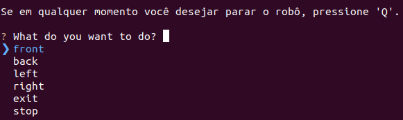

## Introdução 

&emsp;Ao desenvolver projetos que envolvem a execução de robôs teleoperados, é de extrema importância pensar em maneiras para interromper a operação do robô em qualquer momento e de forma fácil e prática, com a finalidade de evitar possíveis eventualidades e riscos que podem trazer problemas ao projeto, para que os testes do protótipo sejam feitos com segurança no ambiente, e também para facilitar a interrupção da operação caso o robô não esteja realizando os comandos em conformidade com o que era esperado. 

## Sistema de Emergência

&emsp;Pensando em um robô teleoperado, um mecanismo de emergência foi criado neste projeto, permitindo o operador enviar um comando de parada imediata ao robô através da CLI para o TurtleBot, em caso de qualquer eventualidade ou risco observado.

&emsp;Para interromper a operação do robô durante a execução dos comandos desejados pelo usuário, basta pressionar a tecla Q na CLI. Isso fará com que a execução do script seja interrompida imediatamente e o robô pare de realizar suas ações.

Na figura abaixo, é possível ver o prompt que faz o robô parar completamente.

<p align="center"><b> Como utilizar a parada de emergência </b></p>
<div align="center">
  
  <p><b>Fonte:</b> Elaborado por Cannabot</p>
</div>


&emsp; Com o sistema de emergência podendo ser acionado a qualquer instante, é adicionada uma camada a mais de proteção ao operador e ao próprio robô. Garantir que o robô pare imediatamente evita grandes complicações e aumenta significativamente a segurança.

&emsp;Tudo isso é garantido com a biblioteca Typer, que possibilita a criação da CLI e dentro dela a definição de ações quando determinada tecla for pressionada.

No código abaixo, é possível notar que todos os parâmetros de velocidade são definidos como zero no instante em que o usuário pressiona a tecla Q.

<p>Função que define uma exceção quando uma tecla for pressionada </p>
<div>
```python
def show_menu():
    questions = [
        {
            'type': 'list',
            'name': 'action',
            'message': 'What do you want to do?',
            'choices': ['front', 'back', 'left', 'right', 'exit', 'stop'],
        },
    ]
    # Definição da tecla Q 
    keybindings: InquirerPyKeybindings = {
        "interrupt": [{"key": "q"}, {"key": "c-c"}],
    }

    try:
        return prompt(questions, keybindings=keybindings)['action']
    except KeyboardInterrupt:
        return 'panic'
```
</div>

&emsp;Logo que a tecla *Q* é pressionada, ocorre o acionamento da função de parada de emergência que interrompe completamente o movimento do robô, definindo a movimentação para zero em todos os eixos e desligando o nó ROS em seguida.

&emsp;Ao entrar no código da função Main, é possível ver que a função que zera toda a velocidade do robô é acionada imediatamente, seguida pela destruição do nó ROS, o que interrompe completamente a comunicação e torna a solução mais segura.

<div>
<p>Desligamento completo do robô  </p>

```python 
def main():
    rclpy.init(args=None)
    robot = TurtleBot()

    print(
"""
Se em qualquer momento você desejar parar o robô, pressione 'Q'.
"""
    )
    while True:
        action = show_menu()
        match action:
            case 'panic':
                print("Parada de emergência")
                robot.emergency_stop()
                robot.destroy_node()
                rclpy.shutdown()
                exit()
```
</div>


<p>Função que para o robô completamente </p>
<div>
```python 
    def emergency_stop(self):
        self.move(Vector3(x=0.0, y=0.0, z=0.0), Vector3(), 0.0)
```
</div>

Assim, quando o usuário pressiona a tecla Q, o robô tem todos os seus parâmetros de velocidade definidos como zero, a comunicação entre nós ROS é interrompida e o sistema do robô é desligado por completo. 

## Conclusão

&emsp;Dessa forma, é possível dizer que a implementação de um sistema de emergência ao robô teleoperado é crucial para garantir a segurança para que o robô opere conforme o esperado. Ao permitir que o operador interrompa imediatamente as operações do robô através de um comando simples, pressionando a tecla *Q*, potenciais riscos e eventualidades podem ser mitigados de forma eficaz. 
