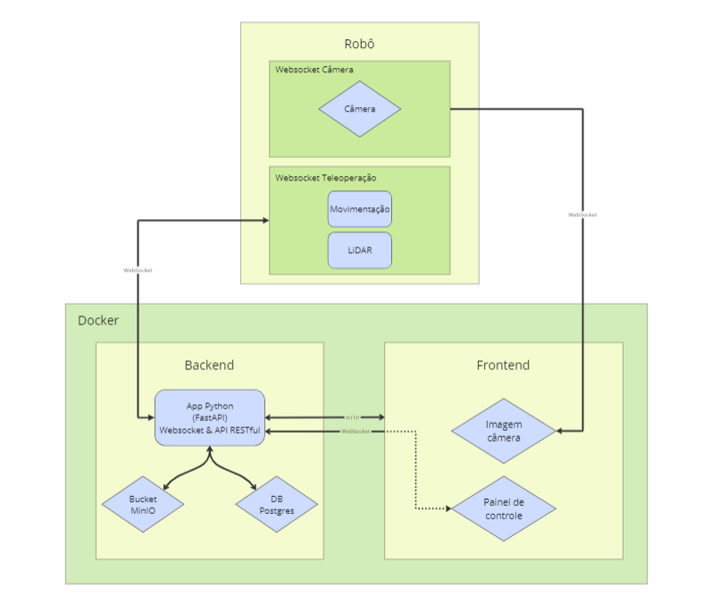

## Introdução

Nessa seção, será detalhado como está nossa arquitetura do sistema na terceira sprint, lembrando que a arquietura vai sofrer mudanças até chegar na versão final do projeto. Nessa, sprint nos conseguimos avançar mais tecnicamente e conseguimos implementar mais funcionalidades no robô, como a transmissão de imagens em tempo real e a teleoperação do robô através de uma interface web.

## Arquitetura do sistema

A arquitetura do sistema foi dividida em quartro partes principais, sendo elas: o robô, backend, frontend e docker. A seguir, será detalhado cada uma dessas partes.

<b> Figura da arquitetura da solução</b>

  
  
<b>Fonte:</b> Elaborado por Cannabot

### Robô

O robô é Turtlebot 3, que possui uma Raspberry Pi 4, que é responsável por controlar o robô e processar as imagens capturadas pela câmera. No robô, roda dois websockets, um deles é responsável por enviar as imagens capturadas pela câmera para o frontend e o outro é responsável por receber os comandos de movimentação e enviar os dados do LiDAR para o backend. 

### Backend

O nosso backend é feito em Pythom, utilizando o framework FastAPI. O backend está constituído por tanto por um websocket quanto por uma API REST. O websocket é responsável por receber os dados do robô, do LiDAR, enviar os comandos de movimentação para o robô e enviar e receber os comandos do frontend. Já a API REST é responsável por armazenar dados no banco de dados e fornecer esses dados para o frontend. 

Além disso, temos nosso banco em PostgreSQL, que é responsável por armazenar os dados do usuário, dados do robô e log de execução. Também temos um bucket MinIO que é responsável por armazenar as imagens capturadas pelo robô.

### Frontend

O frontend é feito em React, junto com Vite. O frontend é responsável por enviar os comandos de movimentação para o robô, exibir avisos de obstáculos, exibir as imagens capturadas pelo robô e exibir os dados do banco de dados. As imagens capturadas pelo robô são exibidas em tempo real, através do websocket que recebe as imagens diretamente do robô.

### Docker

O docker é responsável por rodar o backend, frontend, banco de dados e MinIO. O docker-compose é responsável por orquestrar os containers, permitindo que o projeto seja facilmente executado em qualquer máquina que tenha o docker instalado.

Nessa arquitetura, priorizamos que tudo que havia ROS ficasse no robô, assim fazendo com que outros sistemas operacionais, diferente do Linux, pudessem rodar o projeto sem muitas dificuldades.