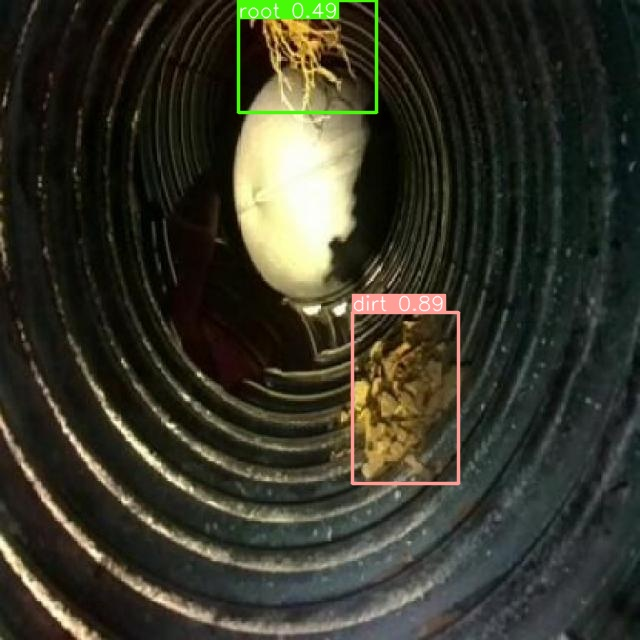

# Documentação do modelo

## Introdução

&emsp;O modelo de visão computacional é um elemento importante no projeto. A implementação foi feita pensando em diminuir a carga cognitiva para o operador do robô. Assim, a ia é capaz de detectar determinado objeto estranho que possa estar dentro do reboiler durante a operação. Nesta secção estarão documentados o processo de treinamento do modelo, dataset utilizado, implementação e próximos passos.

## Modelo
&emsp;Precisando de um modelo de visão computacional que fosse rápido em conseguir detectar objetos estranhos dentro do reboiler foi utilizado o modelo [YOLO V8](https://github.com/ultralytics/ultralytics). Esse é um modelo muito utilizado por diversas pessoas e empresas ao redor do globo. Possui uma ampla documentação e pode ser aplicado em diversos tipos de problemas que requerem o uso de visão computacional.

## Dataset e Treinamento

#### Dataset
&emsp;O problema de detectar objetos que possam estar dentro do reboiler é complexo, pensando que o robô está sendo desenvolvido com o objetivo de funcionar dentro de um ambiente escuro e inóspito para as maiorias das formas de vida.O modelo de ia tem que ser capaz de detectar possíveis corpos estranhos. 

&emsp;Com esse problema em mente a solução foi encontrada utilizando um dataset que serve para identificar objetos estranhos em tubulações de esgoto. Para mais informações sobre o mesmo é possível saber mais no seguinte [link](https://universe.roboflow.com/purdue-university-niruh/precision-ag-subterranean) 


#### Treinamento
&emsp;Para treinar o modelo foi utilizado uma instância do Google Colab com uma gpu T4. O motivo da utilização do colab foi seu ambiente fácil de desenvolvimento e a capacidade de suprir as demandas computacionais em um intervalo de tempo satisfatório. 

&emsp;O processo de treinamento do modelo ao utilizar a Yolo-V8 é muito simples, só basta instalar a biblioteca da ultralytics, definir um dataset e começar a realizar o treinamento do modelo. 

```python
model = YOLO("yolov8n.yaml")
results = model.train(data='../dataset/dirt_detection/data.yaml', epochs=100)
```

&emsp;Com duas linhas de código o modelo já está sendo treinado. Após essa etapa só basta exportar o modelo e começar a utilizar o mesmo. Para mais detalhes de como o modelo foi implementado é recomendado acessar o notebook de treinamento. O mesmo está localizado no repositório do projeto no seguinte caminho: *src/ia/notebooks/model_creation.ipynb*.

Na figura abaixo é possível ver como é o resultado da detecção do modelo

<p align="center"><b> Detecção com yolo</b></p>
<div align="center">
  
  <p><b>Fonte:</b> Elaborado por Cannabot</p>
</div>


## Implementação do modelo 

&emsp;Após o treinamento do modelo é preciso utilizá-lo. Assim, utilizando a biblioteca da ultralytics, é possível enviar inputs para o modelo e o mesmo retorna se detectou um objeto estranho no reboiler. Aproveitando a conexão websocket os inputs da camera quando necessário, são enviados para o modelo de ia e o resultado é retornado no frontend. 
O modo que tal implementação foi feita pode ser visto com mais detalhes no arquivo:*src/backend/src/client/camera.py*.

O código que executa a detecção é o seguinte: 

```python
    async def process_message(self, message):
        data = json.loads(message)
        if "bytes" in data:
            img_data = base64.b64decode(data["bytes"])
            np_arr = np.frombuffer(img_data, np.uint8)
            img = cv2.imdecode(np_arr, cv2.IMREAD_COLOR)
            results = self.yolo_model.predict(img)  # Rodar o modelo YOLO


            results = await asyncio.to_thread(self.yolo_model.predict, img)
            results = results[0]

            # Printar o resultado da IA
            print("Probs:", results.probs)
```

## Conclusão e próximos passos
&emsp;Assim, durante a quarta sprint foi desenvolvido e implementado um modelo de visão computacional em um dataset customizado para o problema da Atvos. Na próxima sprint, o objetivo é utilizar outra biblioteca no lugar da ultralytics para realizar a predição. Apesar de ser muito boa e capaz de abstrair muitas coisas para que a utilização da IA se torne fácil. Isso acaba se tornando um problema, pois a biblioteca é muito grande e demanda muito tempo para que o backend do projeto esteja no ar rodando. 
Logo, na última sprint há a necessidade de procurar um método mais rápido e leve para instanciar e fazer consultas ao modelo de IA. 
