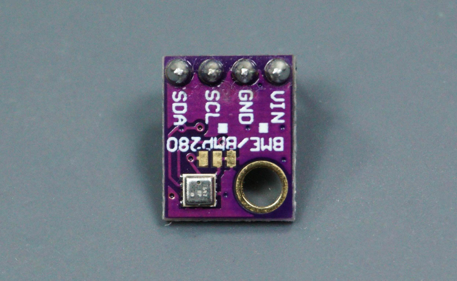
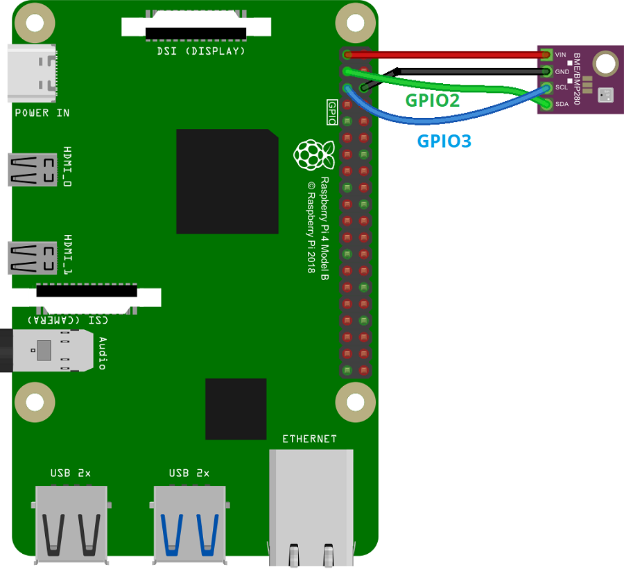

# Sensor de Temperatura

&emsp;O presente documento tem como objetivo detalhar o sensor de temperatura utilizado no projeto Cannabot. Foi planejado a utilização do sensor de temperatura para monitorar a temperatura de diversas regiões do reboiler em operação, permitindo que possa ver em qual região a temperatura está menor, indicando que pode haver tubos entupidos na região.

&emsp;O sensor de temperatura utilizado é o modelo BME/BMP280, um sensor que mede a temperatura, pressão e umidade do ambiente. O sensor é conectado ao Raspberry Pi 4 por 4 jumpers, e realizamos a interface com ele usando a biblioteca de python `RPi.bme280 v0.2.4`.

<p align="center"><b>Imagem do Sensor</b></p>
<div align="center">
  
  <p><b>Fonte:</b>Imagem retirada do artigo de utilização do sensor do randomnerdtutorials</p>
</div>

## Montagem do sensor

&emsp;O sensor de temperatura é conectado ao Raspberry Pi 4 por 4 jumpers, formando a seguinte conexão:

| Sensor BME280 | Raspberry Pi 4  |
|---------------|-----------------|
| VIN           | 3.3V            |
| GND           | GND             |
| SCL           | GPIO 3          |
| SDA           | GPIO 2          |

Segue abaixo a imagem da conexão do sensor de temperatura com o Raspberry Pi 4:

<p align="center"><b>Conexão do sensor com a placa</b></p>
<div align="center">
  
  <p><b>Fonte:</b>Imagem retirada do artigo de utilização do sensor do randomnerdtutorials</p>
</div>

&emsp;Após montar a conexão, é necessário instalar a biblioteca `RPi.bme280 v0.2.4` para realizar a leitura da temperatura, pressão e umidade do ambiente e ativar a comunicação I2C no Raspberry Pi 4. Para ativar a comunicação I2C, basta seguir o tutorial disponível no site [randomnerdtutorials](https://randomnerdtutorials.com/raspberry-pi-bme280-sensor-python/).

&emsp;Após fazer isso basta rodar o nó de ROS que publica a temperatura lida pelo sensor ao tópico ROS `/sensor_data`, detalhado na próxima seção.

## Nó de ROS

&emsp;Para a integração do sensor de temperatura com o ROS, foi criado um nó que publica a temperatura lida pelo sensor ao tópico ROS `/sensor_data`. O nó foi desenvolvido em Python e utiliza a biblioteca `RPi.bme280 v0.2.4` para realizar a leitura da temperatura (como mencionado anteriormente) além da biblioteca `smbus v0.3.4` para a interface com a pinagem do RPi.

&emsp;O nó é responsável por realizar a leitura da temperatura, umidade e pressão a cada 2 segundos e publicar o valor lido no tópico `/sensor_data`. O valor é publicado em um objeto do tipo `String`, porem nada mais e do que um JSON "stringified".

### Estrutura do JSON

```json
{
    "temperature_celsius": <float>,
    "temperature_fahrenheit": <float>,
    "pressure": <float>,
    "humidity": <float>
}
```

&emsp;Onde:

- `temperature_celsius`: Temperatura em graus Celsius.
- `temperature_fahrenheit`: Temperatura em graus Fahrenheit.
- `pressure`: Pressão atmosférica.
- `humidity`: Umidade relativa do ar.

Segue abaixo o código do nó de ROS que publica a temperatura, pressão e umidade do ambiente:

```python

import json

import bme280
import rclpy
import smbus2
from rclpy.node import Node
from std_msgs.msg import String


class BME280Publisher(Node):
    def __init__(self):
        super().__init__('bme280_publisher') # type: ignore
        self.publisher_ = self.create_publisher(String, '/sensor_data', 10)
        self.timer = self.create_timer(2.0, self.timer_callback)

        # BME280 sensor address (default address)
        self.address = 0x76
        # Initialize I2C bus
        self.bus = smbus2.SMBus(1)
        # Load calibration parameters
        self.calibration_params = bme280.load_calibration_params(self.bus, self.address)

    def celsius_to_fahrenheit(self, celsius):
        return (celsius * 9/5) + 32

    def timer_callback(self):
        try:
            # Read sensor data
            data = bme280.sample(self.bus, self.address, self.calibration_params)

            # Extract temperature, pressure, and humidity
            temperature_celsius = data.temperature
            pressure = data.pressure
            humidity = data.humidity

            # Convert temperature to Fahrenheit
            temperature_fahrenheit = self.celsius_to_fahrenheit(temperature_celsius)

            # Create the JSON message
            sensor_data = {
                'temperature_celsius': temperature_celsius,
                'temperature_fahrenheit': temperature_fahrenheit,
                'pressure': pressure,
                'humidity': humidity
            }
            msg = String()
            msg.data = json.dumps(sensor_data)

            # Publish the message
            self.publisher_.publish(msg)

            # Log the readings
            self.get_logger().info(f'Publishing: {msg.data}')

        except Exception as e:
            self.get_logger().error(f'An unexpected error occurred: {str(e)}')

def main(args=None):
    rclpy.init(args=args)
    node = BME280Publisher()
    try:
        rclpy.spin(node)
    except KeyboardInterrupt:
        pass
    finally:
        node.destroy_node()
        if rclpy.ok():
            rclpy.shutdown()

if __name__ == '__main__':
    main()

```

## Conexão ao Backend

&emsp;Para a conexão do sensor de temperatura ao backend, o programa de websocket principal do robô, que expõe uma rota de websocket para controle e monitoramento foi ampliado, integrando mais um "subscriber" para assim publicar as informações extraídas a uma interface acessível de fora do robô. Isso pode ser conferido no código no arquivo `src/package/workspacewebsocket_robot/websocket_robot/websocket_robot.py`. A parte desse código relacionada ao sensor de temperatura é a seguinte:

```python

self.create_subscription(String, '/sensor_data', self.temp_callback, 10)

def temp_callback(self, msg):
    jsonified = json.loads(msg.data)
    self.get_logger().info(f'Temperatura: {jsonified}')
    broadcast(json.dumps({
        'temperature': jsonified['temperature_celsius']
    }))

```

