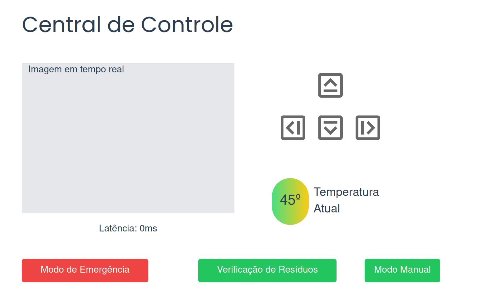

&emsp;Este documento descreve o Sistema de Segurança desenvolvido para o projeto Cannabot, com o objetivo de garantir operações seguras do robô e a proteção dos operadores envolvidos. As principais medidas implementadas incluem um botão de parada de emergência e um sistema de detecção de obstáculos com parada automática do robô, visando proporcionar maior controle operacional e prevenir acidentes. A seguir, apresentamos uma análise detalhada do funcionamento de cada uma dessas medidas de segurança.

## Botão de Parada de Emergência

### Funcionamento

&emsp;Durante a Sprint 2, a equipe Cannabot apresentou a primeira versão da funcionalidade de parada de emergência do robô, inicialmente implementada através da interface de linha de comando (CLI). Na Sprint 3, com a introdução da interface de usuário mostrada a seguir, foram realizadas alterações significativas na forma de ativação dessa função.

<p align="center"><b> Figura da Central de Controle</b></p>
<div align="center">
  
  <p><b>Fonte:</b> Elaborado por Cannabot</p>
</div>

&emsp;No projeto final (sprint 5), mantivemos a ativação da parada de emergência por meio da interface gráfica, conforme a imagem acima. Ao clicar no botão "Modo de Emergência" na tela "Central de Controle" do frontend, o usuário aciona o serviço de emergência. Este serviço Ros, ao ser requisitado, executa a função de parada do robô, fechando a conexão. Dessa forma, mesmo que haja tentativas de movimentar o robô através dos comandos do frontend, ele permanecerá imóvel. A única forma de restabelecer o funcionamento normal é reiniciando o robô manualmente.

### Implementação do código
 
&emsp;Como explicado no documento de teleoperação do robô, foi criado uma classe ("Robot") que tem por objetivo gerenciar os serviços, tópicos e ações relacionadas a ele. Dentro da classe é implementada as seguintes funções:

```Python
    def emergency(self):
        self.get_logger().info('PARADA DE EMERGÊNCIA ATIVADA')
        self.stop()

    def stop(self):
        self.publisher.publish(Twist())
        self.get_logger().info('Parando o robô...')
        rclpy.shutdown()
```
&emsp;A partir da lógica do websocket, quando o botão é pressionado na interface, é enviado uma mensagem de "emergency", responsável por chamar a função explicitada acima e fechando a conexão com o robô.

&emsp;A lógica em questão é evidenciada no código a seguir:

```Python
@app.websocket("/ws_control")
    async def websocket_endpoint(websocket: WebSocket):
        await websocket.accept()

        clients.add(websocket)

        try:
            while True:
                # Receber o comando de movimento do robô
                data = await websocket.receive_text()

                print(f"Recebido: {data}")

                # Parse do JSON recebido
                message_data = json.loads(data)
                command = message_data['control']  # Comando de movimento
                print(f"Comando: {command}")
                # Atualizar o estado do robô

                if command not in ['stopped', 'forward', 'left', 'right', 'backward', 'emergency']:
                    # Enviar mensagem de erro pelo WebSocket
                    await websocket.send_text(json.dumps({'error': 'Comando inválido'}))
                    continue

                if command == "emergency":
                    robot.emergency()
                    break

                robot.state = command

        except Exception as e:
            print(f"Erro: {e}")
            await websocket.close()

    return app
```

## Detecção de Obstáculo e Parada Imediata

### Funcionamento

&emsp;Uma abordagem crucial para garantir a segurança do sistema foi implementada através da detecção de obstáculos à frente ou atrás do robô. Essa funcionalidade desempenha um papel fundamental na prevenção de colisões e na garantia da integridade do equipamento e do ambiente ao seu redor.

A detecção de obstáculos permite que o robô reaja de forma proativa, impedindo qualquer movimento em direção a esses obstáculos, mesmo que o usuário tente comandar essa ação. Essa capacidade é especialmente vital em ambientes dinâmicos e imprevisíveis.

Para incorporar essa funcionalidade, utilizamos o Lidar. O LIDAR (Light Detection and Ranging) é um sensor que mede distâncias e detecta objetos ao redor do robô. Esse sensor emite um feixe de laser que varre o ambiente, calculando o tempo que leva para o feixe refletir de volta ao sensor após atingir um objeto. No modelo do Turtlebot3, o robô utilizado nesta prova de conceito, o Lidar já está integrado.

Com base nos dados fornecidos pelo Lidar, foi possível implementar uma lógica que impede a colisão do robô. Nessa lógica, é criada uma lista contendo todos os registros do lidar em uma varredura de 360 graus. Como essa lista é dinâmica, foi criada uma variável que armazena o tamanho dessa lista. A partir dessa informação, implementamos a lógica para determinar se há obstáculos à frente ou atrás do robô.

A lógica empregada consiste em dividir a lista em quatro partes para definir os quadrantes que compõem a circunferência do lidar. As variáveis A e B representam, respectivamente, as delimitações do primeiro e do último quadrante, partindo do ângulo 0. Para detectar se um obstáculo está atrás do robô, verificamos se seu índice na lista é maior que A e menor que B, ou seja, se ele está no segundo ou terceiro quadrante. Caso contrário, o obstáculo está à frente do robô.

Consideramos uma distância de 0,2 metros como critério para determinar a presença de um obstáculo.

A partir do momento que um obstáculo é detectado, não é possível pressionar a tecla de controle em sua direção. Ou seja, se é detectado um obstáculo à frente, não é possível mais movimentar o robô para frente, apenas nas outras direções, e vice-versa.

Essa abordagem dinâmica permite que o robô ajuste seu comportamento de acordo com a presença de obstáculos, garantindo uma navegação segura e eficiente em ambientes desafiadores. O monitoramento constante do Lidar e a adaptação contínua do comportamento do robô contribuem significativamente para a segurança e a confiabilidade do sistema como um todo.

### Implementação do código

&emsp;Como explicado no documento de teleoperação do robô, foi criado uma classe ("Robot") que tem por objetivo gerenciar os serviços, tópicos e ações relacionadas a ele. Dentro da classe é implementada a seguinte função, que aplica a lógica do LIDAR explicada anteriormente:

```Python
def scan_callback(self, data):
        # Obtém os dados do Lidar
        ranges = data.ranges

        # Verifica se há obstáculos dentro da distância de segurança e enviar o índice da array
        if min(ranges) <= self.safe_distance:
            min_index = ranges.index(min(ranges))
            numero_indices = len(ranges)
            # print('Número de índices:', numero_indices)

            # Calcular os índices que representam a frente e as traseiras
            valor_A = numero_indices // 4
            valor_B = valor_A * 3

            # print('Valor A:', valor_A)
            # print('Valor B:', valor_B)
            # print('Índice:', min_index)

            # Dividir o array de distâncias em frente (de valor_A até valor_B) e trás (de valor_B até o final mais de 0 até valor_A)
            if valor_A < min_index < valor_B:
                # print("Obstáculo átras")
                # return {'obstacle': 'back'}

                if self.lidar_data != 'back':
                    print('Obstáculo detectado atrás')
                    self.lidar_data = 'back'
                    broadcast(json.dumps({'obstacle': 'back'}))
            else:
                # print("Obstáculo na frente")
                # return {'obstacle': 'front'}

                if self.lidar_data != 'front':
                    print('Obstáculo detectado à frente')
                    self.lidar_data = 'front'
                    broadcast(json.dumps({'obstacle': 'front'}))
        else:
            # Se não houver obstáculos próximos, continue em frente
            # print('Nenhum obstáculo detectado')
            # return {'obstacle': 'none'}

            if self.lidar_data != 'none':
                print('Nenhum obstáculo detectado')
                self.lidar_data = 'none'
                broadcast(json.dumps({'obstacle': 'none'}))
```

&emsp;A partir do código acima, 'possível aplicar a lógica que ira movimentar o robô, explicitada a seguir:

```Python
def timer_callback(self):
        twist = Twist()

        match self.state:
            case 'stopped':
                twist.linear.x = 0.0
                twist.angular.z = 0.0
            case 'forward':
                if self.lidar_data == 'none' or self.lidar_data == 'back':
                    twist.linear.x = 0.2
                    twist.angular.z = 0.0
            case 'left':
                twist.linear.x = 0.0
                twist.angular.z = 1.0
            case 'right':
                twist.linear.x = 0.0
                twist.angular.z = -1.0
            case 'backward':
                if self.lidar_data == 'none' or self.lidar_data == 'front':
                    twist.linear.x = -0.2
                    twist.angular.z = 0.0
            case 'emergency':
                self.emergency()
            case _:
                self.get_logger().warn(f'Invalid state: {self.state}')

        self.publisher.publish(twist)
```

&emsp;Essa função, define a movimentação que o robô irá fazer dependendo do commando recebido pela interface. A lógica que envia esse comando é aplicada no seguinte código referente ao websocket:

```Python
@app.websocket("/ws_control")
    async def websocket_endpoint(websocket: WebSocket):
        await websocket.accept()

        clients.add(websocket)

        try:
            while True:
                # Receber o comando de movimento do robô
                data = await websocket.receive_text()

                print(f"Recebido: {data}")

                # Parse do JSON recebido
                message_data = json.loads(data)
                command = message_data['control']  # Comando de movimento
                print(f"Comando: {command}")
                # Atualizar o estado do robô

                if command not in ['stopped', 'forward', 'left', 'right', 'backward', 'emergency']:
                    # Enviar mensagem de erro pelo WebSocket
                    await websocket.send_text(json.dumps({'error': 'Comando inválido'}))
                    continue

                if command == "emergency":
                    robot.emergency()
                    break

                robot.state = command

        except Exception as e:
            print(f"Erro: {e}")
            await websocket.close()

    return app
```

## Considerações finais

&emsp;Com base no que foi apresentado, é perceptível que o sistema de segurança do projeto Cannabot é uma solução robusta e confiável para garantir a operação segura do robô em ambientes dinâmicos e imprevisíveis. A integração de um botão de parada de emergência e um sistema de detecção de obstáculos com parada automática proporciona um controle preciso e preventivo, minimizando o risco de acidentes e danos. Essas medidas de segurança, detalhadamente implementadas e explicadas neste documento, asseguram que o robô opere de maneira eficiente e segura, protegendo tanto os operadores quanto o próprio equipamento. 